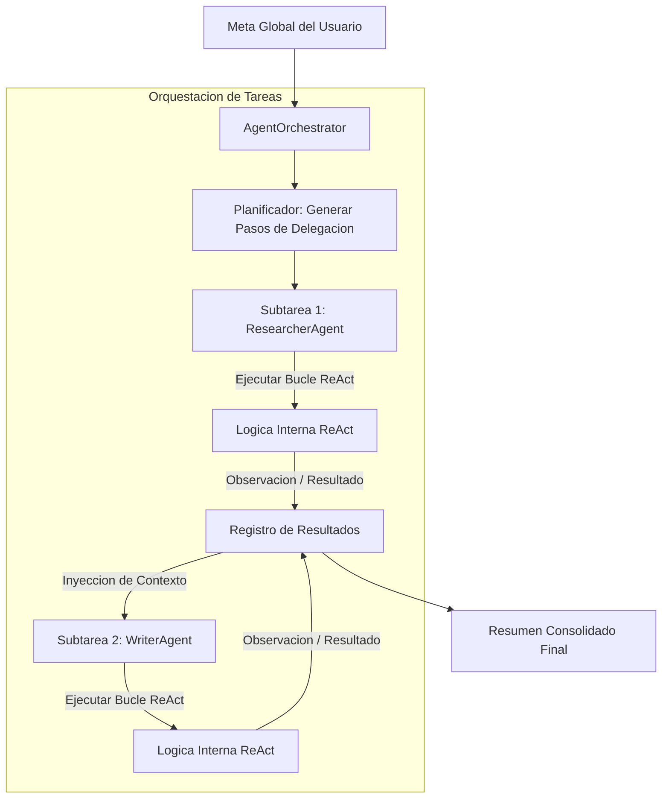

# Orchestra Agents

Framework modular para el diseno, ejecucion y orquestacion de sistemas multi-agente autonomos basados en la metodologia de razonamiento ReAct (Reasoning and Acting). El sistema permite coordinar multiples agentes con roles de especialidad diferenciados (investigadores, redactores, programadores), facilitando la resolucion colaborativa de metas complejas mediante delegacion estructurada y transferencia dinamica de contexto (Message Passing).

## Arquitectura de Multi-Agentes y Razonamiento ReAct

El framework se compone de dos abstracciones nucleares: la ejecucion de la logica individual de cada agente y la coordinacion centralizada del equipo de trabajo.



### 1. El Bucle de Razonamiento ReAct (Reasoning + Acting)

Cada agente de tipo `AutonomousAgent` mantiene un bucle iterativo controlado por prompts estructurados que alternan pasos de analisis reflexivo y ejecucion practica:

1.  **Pensamiento (Thought):** El agente reflexiona sobre la tarea actual y determina el siguiente paso logico o la necesidad de consultar datos externos.
2.  **Accion (Action):** El agente selecciona una herramienta registrada en su catalogo e invoca su ejecucion pasando argumentos especificos:
    $$\text{Formato de Salida:} \quad \text{Action: } \text{nombre\_herramienta}(\text{"argumento"})$$
3.  **Observacion (Observation):** El framework intercepta la llamada, ejecuta el callback de Python asociado y devuelve el resultado textual al agente como una nueva entrada contextual.

La secuencia se repite recursivamente hasta que el agente detecta que dispone de informacion suficiente para redactar la solucion, emitiendo una respuesta con el formato `"Final Answer: <respuesta>"`.

#### Parser de Patrones ReAct
El parser de salida analiza las generaciones mediante expresiones regulares compiladas:
*   *Filtro de Pensamiento:* `Thought:\s*(.*?)(?=(?:Action:|Final Answer:|$))` (captura el scratchpad de razonamiento).
*   *Filtro de Accion:* `Action:\s*(\w+)\((.*?)\)` (captura el nombre de la herramienta y sus argumentos).
*   *Filtro de Conclusion:* `Final Answer:\s*(.*)` (detiene el bucle y devuelve el resultado).

### 2. Orquestacion y Message Passing (Paso de Mensajes)

La clase `AgentOrchestrator` actua como un supervisor central que coordina la descomposicion de problemas complejos.

*   **Descomposicion del Grafo de Tareas:** La meta global es traducida a una secuencia ordenada de subtareas (`TaskDelegation`), donde cada una define el agente asignado y los identificadores de las tareas previas de las que depende (`dependencies`).
*   **Alineacion de Contexto (Message Passing):** Al iniciar un paso del plan, el orquestador recupera las respuestas del registro historico correspondientes a las dependencias declaradas. Estos datos se inyectan en el prompt del agente asignado con etiquetas de apoyo (`[Resultado Tarea X]: ...`), garantizando la continuidad cognitiva.

### 3. Simulador Cognitivo Offline

Para evitar bloqueos y el consumo de cuotas de red durante tests automatizados y CI/CD, el framework incluye un simulador de respuestas neuronales offline. Este analiza el contenido de la tarea y la longitud del `scratchpad` del agente, emitiendo trazas artificiales identicas a las que generaria un LLM en produccion para guiar al agente a traves del arbol de llamadas esperado.

## Conexión con el Ecosistema

Este framework sirve como capa de control logico para el resto del espacio de trabajo:
1.  **nano-vector-db / hybrid-search-retrieval-pipeline:** Se registran como herramientas del catalogo del agente (ejemplo: `search_db`), permitiendo que el `ResearcherAgent` recupere documentos indexados dinamicamente.
2.  **llm-inference-server:** De desactivarse el simulador (`use_mock_llm=False`), las solicitudes del bucle ReAct del agente se canalizan mediante peticiones REST al servidor de inferencia local.
3.  **secure-tool-runtime:** Las herramientas complejas que implican ejecucion de scripts en disco o comandos del sistema se derivan al entorno aislado (Sandbox) para proteger la integridad del sistema operativo.

## Estructura del Proyecto

*   `agent.py`: Clase `AutonomousAgent` que implementa el bucle ReAct, el analizador de expresiones de control y el simulador cognitivo local.
*   `orchestrator.py`: Clase `AgentOrchestrator` y el esquema de datos `TaskDelegation` para administrar planes de colaboracion multi-agente.
*   `test_agents.py`: Pruebas de integracion que verifican la descomposicion de planes, la inyeccion de dependencias de contexto y la prevencion de bucles infinitos en el ReAct.
*   `example.py`: Demostracion interactiva que ejecuta a un equipo compuesto por un investigador y un escritor, generando un reporte final en Markdown.

## Instalacion y Ejecucion

### 1. Configurar Entorno e Instalar Dependencias

Active el entorno virtual del subproyecto:

```bash
python3 -m venv .venv
source .venv/bin/activate
pip install -r requirements.txt
```

### 2. Ejecutar Pruebas Automatizadas

Valide el funcionamiento de las dependencias logicas y la secuenciacion de los agentes:

```bash
.venv/bin/python -m unittest test_agents.py
```

### 3. Ejecutar la Demostracion Multi-Agente

Inicie el script para visualizar la colaboracion en tiempo real entre agentes especializados:

```bash
.venv/bin/python example.py
```

El script imprimira en consola la bitacora completa de pensamientos, invocaciones de herramientas vectoriales y el informe final consolidado por el agente escritor.
